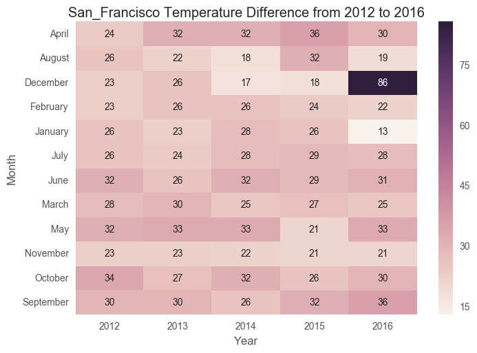
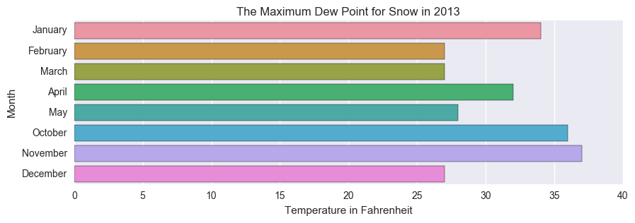

# 
WEATHER ANALYSIS USING PYTHON

# Introduction
- This read me file is presented for the final project of the course **Data Analysis using Python**
- This project is for analyzing the weather condition in 5 different cities in the United States for the period of 5 years from 2012 to 2016
- This project is classified into 2 parts
- The first part is to get an API key from the website "Weather Underground" and download the data in JSON file format using request library
- The downloaded data will then be stored in an organized folder hierarchy also coverted to CSV file format
- The second part will analyze this organized data in three different section
- The analyzed output has been represented in graphs and CSV file
# First Part
# Data Collection and Storage
- The API key is fetched by registering in the website "http://api.wunderground.com/weather/api/d/docs?d=data/history&MR=1"
- The API key is hided using environment variable
- A method is created to generate the date so that this can be called for everyday data generation
- Two list are created and stored with state names and cites respectively for every city data generation
- The data generation using request library is created under a method so that it can be called for every day's data on each city
- The data is taken on every hour basis in a day, so the size is large for a single day file. Since we are not going to use the hour details the data is truncated with python code and stored only the required daily summary report
- This generated data will be in JSON file format and stored in an organized folder hierarchy so that each day's data will have seperate location path
- A method is created for scanning the location path of every JSON file and converting them to a single CSV file for each city
- These CSV files are stored in an organized folder hierarchy
- The data is taken for the city (Boston, Duluth, New_York, Orlando, San_Francisco)
- The data is taken for the period from 1st Jan 2012 to 31th Dec 2016 (5 Years) for each city

# Second Part
# 1_Analysis
 

- **This first analysis explains how the temperature changes to its extreme on the same day itslef.**
- Read all 5 city's CSV file to store them in different dataframe
- Getting the maximum temperature in fahrenheit for each city 
- joining all the city's dataframe together for maximum temperature
- Getting the minimum temperature in fahrenheit for each city 
- joining all the city's dataframe together for minimum temperature
- Merging the maximum and minimum temperature dataframe together
- When ploting the values in the graph it is visible to see which city has the maximum temperature difference
- Stored this data to CSV file
- From the graph the city **San_Francisco** has the maximum temperature difference **120'F**
- Since the city San_Francisco has the maximum temperature difference, we will be analyzing this city on year and month
- A dataframe is created with maximum temperature, minimum temperature, year, month and a new column with the temperature difference (max - min)
- Taking the required columns *year, month and temp_diff* and then converting the month digit to month name
- Plotted a graph using Seaborn heatmap and founded which particular month has the maximum temperature difference
- From the graph it is seen that the month **December in 2016** has the **maximum temperature difference of 86'F** in one day itself
- The output data is stored to a CSV file

# 2_Analysis
- **This second analysis explains in the peak snow fall city what is the maximum dew point temperature to form snow.**
- Read all 5 city's CSV file to store them in different dataframe
- Getting the highest snow fall days for each city 
- joining all the city's dataframe together for highest snow fall days
- When ploting the values in the graph it is visible to see which city has the highest snow fall days
- Stored this data to CSV file
- From the graph the city **Duluth** has the highest snow fall days from 2012 to 2016 which is **425 days**
- Since the city Duluth is the highest snow fall region, we will be analyzing this city on each year 
- A dataframe is created with year and snow days column
- Plotted a graph using Matplotlib Pie and founded which particular year has the highest snow fall
- From the graph it is seen that the year **2013** has the **110 days of snow fall which is 25.9% on 5 years**
- The output data is stored to a CSV file
- After getting the city and period of highest snow fall days, lets find the maximum dew point temperature to form snow
- A dataframe os created with columns year, month and max_dewpoint_temp under the city Duluth in the year 2013
- From the graph it is visible that **November month in 2013 has the maximum temperature** which is the dew point temperature to form snow when air with condense together
- As the result the 2_Analysis, the graph represent that the maximum dew point temperature for the snow formation on the maximum snow fall days of the city **Duluth is 37'F**.
- *Generally the max dew point to form snow is 32'F but in the city Duluth on the highest snow fall year 2013 the maximum dew point is 37'F in the month of November.*

# 3_Analysis
- **This third analysis explains the pattern of continuous rainfall and its frequency on 5 cities from 2012 to 2016.**
- Read all 5 city's CSV file to store them in different dataframe
- A method is created to find the pattern of continuous rainfall days and continuous no_rainfall days and stored them in seperate list, so that it can called for each city with city name in the method argument
- Created a dataframe with continous rainfall days and its frequency within 5 years for each city seperately
- Joining the all the city and forming a single dataframe for continuous rainfall days
- Created a dataframe with continous No_rainfall days and its frequency within 5 years for each city seperately
- Joining the all the city and forming a single dataframe for continuous No_rainfall days
- Graph is plotted using seaborn boxplot to find which city has the longest continous rainfall days
- From the graph it is seen that the city **San_Francisco** has the longest continous rainfall days which is **11 days**
- For the city San_Francisco the frequecy of continous rainfall pattern is plotted in the graph 
- These two graphs explains that there will not be rainfall more than 11 days continuously in San_Francisco
- Graph is plotted using seaborn boxplot to find which city has the longest continous No_rainfall days
- From the graph it is seen that the city **Duluth** has the longest continous No_rainfall days which is **68 days**
- For the city Duluth the frequecy of continous No_rainfall pattern is plotted in the graph 
- These two graphs explains that the No_rain fall days will be there not more than 68 days in Duluth

