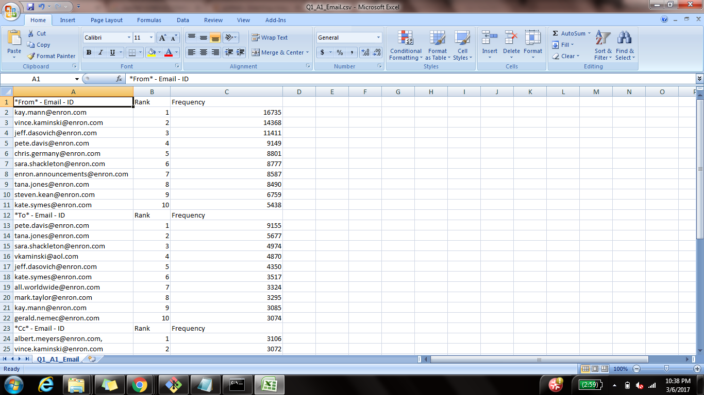
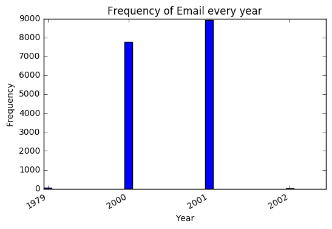
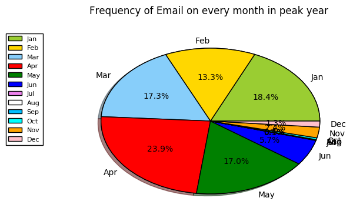
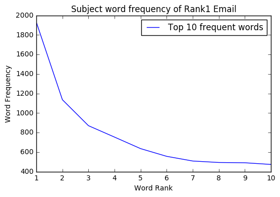
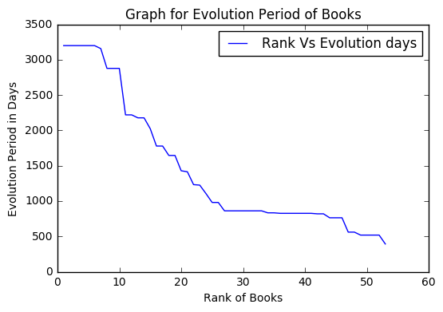
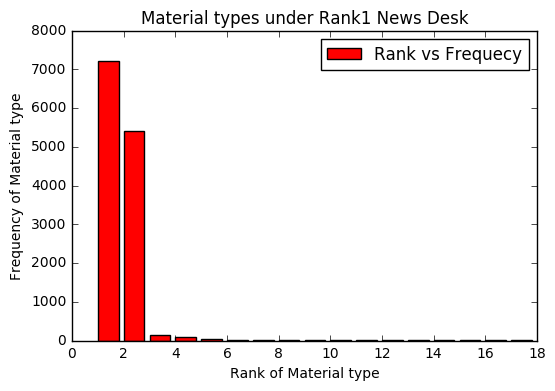
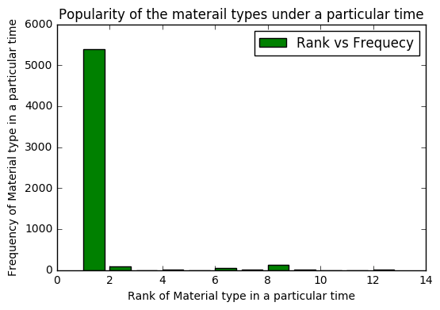

# DATA ANALYSIS USING PYTHON

# Introduction
- This read me file is presented for the midterm exam of the Data Analysis using Python
- There are 2 parts of question in this exam
- Each part has 3 types of Analysis including the data gathering and storing
- For the first question the data has been downloaded from the Enron scandal Summary zip file
- For the second question the data has been downloaded from the NYT API Documentation

# First Question

- The data is collected from the zip file which was downloaded from the provided link with the question. 
- This data is the collection of email which has been used for the Enron Scandal
- This data is structure in the hierarchy of folders for totally 150 person
- Initailly all the requeired libraries are imported
- The Data is scanned by folder by folder then gathered the required data like **From, To, Cc, Bcc, Subject, Date**
- These gathered data is stored in individual list
- With these data the 3 analyzation part of this question will be performed

### Analysis - 1

- To get a person's email ID which has been used to send the maximum number of emails to others 
- Along with that the top 10 frequency of emails received and sent has been collected
- This is performed by the email keyword **From, To, Cc, Bcc**
- The total count email from these key are gathered and equaly distributed based on their frequency using Frequency Distribution from NLTK
- Listing the top 10 high frequenced email for the above mentioned keywords
- Storing all the data together in one CSV file
- Form the top ten of the From keyword the most frequently sent email ID of the person is identified and given rank 1 position
- This is the output of the analysis_1 

### Analysis - 2 

- The output of the analysis_1 is used as a input of this analysis_2
- The rank1 frequency email from the keyword FROM is used for analyzing realated to the time
- In which year does this email has sent more number of emails
- After finding the peak year, finding on which month does this email has used to sent more emails to others
- Gathering the output and stored in two different CSV file one for the year and other for the month
- With the output data the bar and pie graphs are plotted

### Analysis - 3

- In this third part of the analyzation the output of the analysis_1 is taken as input here
- From that particular email we are going check the every subject message of the email and analyze the word used
- Collecting the subject message from the **Subject** keyword and stored it in a list
- Spliting all the messages into words
- Making all the characters to its lowercase
- Exclusively taking the alphabet words
- Removing the stopwords from the list of words
- Then converting the list to dictionery to find the word and its frequency 
- Displaying them with headings and assigning the rank from the most frequent word
- This Stored this data to a CSV file
- Then plotted the graph with this data with rank on x-axis and frequency on y-axis

# Second Question

- This data collected from **The New York Times Developer Network** 
- By generating the API key using our emailID we will have access to the data required
- For this analysis the data has been extracted from **Archive** and **BOOK**
- Using the python script under **request** library the data is downloaded and stored in the relative path
- Then the following three analysis is done using this data

### Analysis - 1

- This analyzation is used to find the time period of a book from which it is evolved
- For this calculation we need the first publication date and last publication date
- From the NYT API - BOOK, the data from the parameter **oldest_published_date** and **newest_published_date** is collected and stored in a list
- This raw data need to be striped and should be converted to the date format
- After subtracting the first publication date from the last publication date, the output is converted to number of days
- This calculation is done on every book and assigned a rank from the book which has more evolution period in days
- The data is stored in a CSV file
- Then graph is plotted for book rank against it evolution period in days

### Analysis - 2

- In this analyzation we are going find the most frequent News desk which has more similar type of news material
- First getting the **News desk** from the **Archive API data** and figured the frequency distribution 
- The top frequent news deck is picked out and now we are finding the news material type for that
- Finally finding which **news material type** is used in the top frequent **News desk**
- After making the frequency distribution for **news material type** assigning the rank for the most frequent news material
- This data is stored in a CSV file 
- The graph is plotted for **news material type** against its frequency under the top frequent **News desk**

### Analysis - 3

- To find which type of material news are famous in a particular time period using the data "Archive API"
- Getting the type of material news and made frequency distribution then on specifing the condition for the specific time period
- The particular type of material news are listed with their frequency then assigned rank from the most frequent type of material news
- Store the gathered data to a CSV file
- Plot the graph for the type of material and their frequency in a particular time period 

