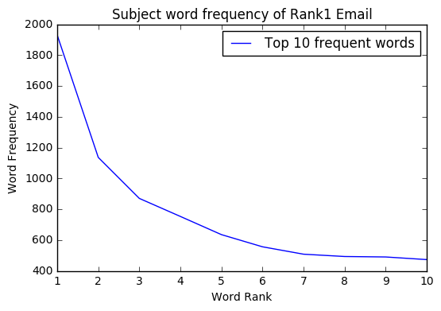
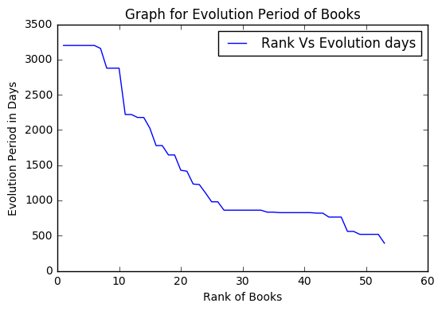
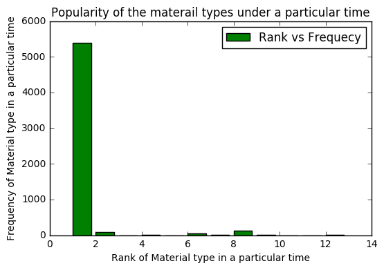

{
 "cells": [
  {
   "cell_type": "markdown",
   "metadata": {},
   "source": [
    "# DATA ANALYSIS USING PYTHON"
   ]
  },
  {
   "cell_type": "markdown",
   "metadata": {},
   "source": [
    "\n",
    "# Introduction\n",
    "- This read me file is presented for the midterm exam of the Data Analysis using Python\n",
    "- There are 2 parts of question in this exam\n",
    "- Each part has 3 types of Analysis including the data gathering and storing\n",
    "- For the first question the data has been downloaded from the Enron scandal Summary zip file\n",
    "- For the second question the data has been downloaded from the NYT API Documentation\n",
    "\n"
   ]
  },
  {
   "cell_type": "markdown",
   "metadata": {},
   "source": [
    "\n",
    "# First Question\n",
    "\n",
    "- The data is collected from the zip file which was downloaded from the provided link with the question. \n",
    "- This data is the collection of email which has been used for the Enron Scandal\n",
    "- This data is structure in the hierarchy of folders for totally 150 person\n",
    "- Initailly all the requeired libraries are imported\n",
    "- The Data is scanned by folder by folder then gathered the required data like **From, To, Cc, Bcc, Subject, Date**\n",
    "- These gathered data is stored in individual list\n",
    "- With these data the 3 analyzation part of this question will be performed\n",
    "\n"
   ]
  },
  {
   "cell_type": "markdown",
   "metadata": {},
   "source": [
    "### Analysis - 1\n",
    "\n",
    "- To get a person's email ID which has been used to send the maximum number of emails to others \n",
    "- Along with that the top 10 frequency of emails received and sent has been collected\n",
    "- This is performed by the email keyword **From, To, Cc, Bcc**\n",
    "- The total count email from these key are gathered and equaly distributed based on their frequency using Frequency Distribution from NLTK\n",
    "- Listing the top 10 high frequenced email for the above mentioned keywords\n",
    "- Storing all the data together in one CSV file\n",
    "- Form the top ten of the From keyword the most frequently sent email ID of the person is identified and given rank 1 position\n",
    "- This is the output of the analysis_1 "
   ]
  },
  {
   "cell_type": "markdown",
   "metadata": {},
   "source": [
    ""
   ]
  },
  {
   "cell_type": "markdown",
   "metadata": {},
   "source": [
    "### Analysis - 2 \n",
    "\n",
    "- The output of the analysis_1 is used as a input of this analysis_2\n",
    "- The rank1 frequency email from the keyword FROM is used for analyzing realated to the time\n",
    "- In which year does this email has sent more number of emails\n",
    "- After finding the peak year, finding on which month does this email has used to sent more emails to others\n",
    "- Gathering the output and stored in two different CSV file one for the year and other for the month\n",
    "- With the output data the bar and pie graphs are plotted\n"
   ]
  },
  {
   "cell_type": "markdown",
   "metadata": {},
   "source": [
    ""
   ]
  },
  {
   "cell_type": "markdown",
   "metadata": {},
   "source": [
    ""
   ]
  },
  {
   "cell_type": "markdown",
   "metadata": {},
   "source": [
    "### Analysis - 3\n",
    "\n",
    "- In this third part of the analyzation the output of the analysis_1 is taken as input here\n",
    "- From that particular email we are going check the every subject message of the email and analyze the word used\n",
    "- Collecting the subject message from the **Subject** keyword and stored it in a list\n",
    "- Spliting all the messages into words\n",
    "- Making all the characters to its lowercase\n",
    "- Exclusively taking the alphabet words\n",
    "- Removing the stopwords from the list of words\n",
    "- Then converting the list to dictionery to find the word and its frequency \n",
    "- Displaying them with headings and assigning the rank from the most frequent word\n",
    "- This Stored this data to a CSV file\n",
    "- Then plotted the graph with this data with rank on x-axis and frequency on y-axis\n"
   ]
  },
  {
   "cell_type": "markdown",
   "metadata": {},
   "source": [
    ""
   ]
  },
  {
   "cell_type": "markdown",
   "metadata": {},
   "source": [
    "\n",
    "# Second Question\n",
    "\n",
    "- This data collected from **The New York Times Developer Network** \n",
    "- By generating the API key using our emailID we will have access to the data required\n",
    "- For this analysis the data has been extracted from **Archive** and **BOOK**\n",
    "- Using the python script under **request** library the data is downloaded and stored in the relative path\n",
    "- Then the following three analysis is done using this data"
   ]
  },
  {
   "cell_type": "markdown",
   "metadata": {},
   "source": [
    "### Analysis - 1\n",
    "\n",
    "- This analyzation is used to find the time period of a book from which it is evolved\n",
    "- For this calculation we need the first publication date and last publication date\n",
    "- From the NYT API - BOOK, the data from the parameter **oldest_published_date** and **newest_published_date** is collected and stored in a list\n",
    "- This raw data need to be striped and should be converted to the date format\n",
    "- After subtracting the first publication date from the last publication date, the output is converted to number of days\n",
    "- This calculation is done on every book and assigned a rank from the book which has more evolution period in days\n",
    "- The data is stored in a CSV file\n",
    "- Then graph is plotted for book rank against it evolution period in days"
   ]
  },
  {
   "cell_type": "markdown",
   "metadata": {},
   "source": [
    ""
   ]
  },
  {
   "cell_type": "markdown",
   "metadata": {},
   "source": [
    "### Analysis - 2\n",
    "\n",
    "- In this analyzation we are going find the most frequent News desk which has more similar type of news material\n",
    "- First getting the **News desk** from the **Archive API data** and figured the frequency distribution \n",
    "- The top frequent news deck is picked out and now we are finding the news material type for that\n",
    "- Finally finding which **news material type** is used in the top frequent **News desk**\n",
    "- After making the frequency distribution for **news material type** assigning the rank for the most frequent news material\n",
    "- This data is stored in a CSV file \n",
    "- The graph is plotted for **news material type** against its frequency under the top frequent **News desk**\n"
   ]
  },
  {
   "cell_type": "markdown",
   "metadata": {},
   "source": [
    ""
   ]
  },
  {
   "cell_type": "markdown",
   "metadata": {},
   "source": [
    "### Analysis - 3\n",
    "\n",
    "- To find which type of material news are famous in a particular time period using the data \"Archive API\"\n",
    "- Getting the type of material news and made frequency distribution then on specifing the condition for the specific time period\n",
    "- The particular type of material news are listed with their frequency then assigned rank from the most frequent type of material news\n",
    "- Store the gathered data to a CSV file\n",
    "- Plot the graph for the type of material and their frequency in a particular time period "
   ]
  },
  {
   "cell_type": "markdown",
   "metadata": {},
   "source": [
    ""
   ]
  }
 ],
 "metadata": {
  "anaconda-cloud": {},
  "kernelspec": {
   "display_name": "Python [default]",
   "language": "python",
   "name": "python3"
  },
  "language_info": {
   "codemirror_mode": {
    "name": "ipython",
    "version": 3
   },
   "file_extension": ".py",
   "mimetype": "text/x-python",
   "name": "python",
   "nbconvert_exporter": "python",
   "pygments_lexer": "ipython3",
   "version": "3.5.2"
  }
 },
 "nbformat": 4,
 "nbformat_minor": 1
}
